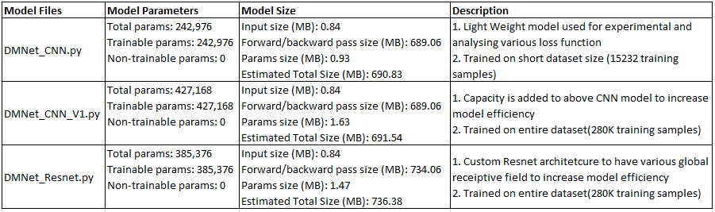
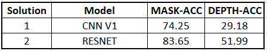

## Assignment-15: 
**Building a model for mask and depth map prediction for custom dataset where foreground are overlay over background and it equivalent ground truth mask and depth are given as target images.**

* Custom Dataset and data loaded functions
* Data split: 70:30(train:test)
* Image augmentation techniques
* Experiment with different Loss functions
* Technique for accuracy calculation
* Experiment with various model architecture
* Strategy for beating 12 hours colab limitation run


## Dataset overview?

* Dataset size: 400K
* Background theme: "Classroom"
* Foreground objects: student or/and teacher
* For building of model we need four kind of images: 
  * Input images: bg images, fg_bg images, 
  * Target Images: fg_bg mask images, fg_bg_depth images 
* For details on how dataset is created?, refer [(Link)](../S15/)

Let's have quick summary of dataset and visulaization for each kind of images

**Dataset statistics**


## Major Components (Contents)

* Custom Dataset Class, DepthMapDataset.py[(Link)](utils/DepthMapDataset.py)
* Memory Profiling and Timing Profiling, TimeMemoryProfile.py [(Link)](utils/TimeMemoryProfile.py)
* Model utilities functions, depth_model_utils.py [(Link)](utils/depth_model_utils.py) 
* Model Architecture
  * DMNet_CNN.py [(Link)](models/depthmap/DMNet_CNN.py): light weight model and used for experimental and analysis 
  * DMNet_CNN_V1.py [(Link)](models/depthmap/DMNet_CNN_V1.py): Higher capacity CNN model to increase model efficiency
  * DMNet_Resnet.py [(Link)](models/depthmap/DMNet_Resnet.py): Custom Resnet architetcure to have various global receiptive field to increase model efficiency
* Data Augmentation
* Analysing various loss functions, EVA4S15_loss_algo_compare.ipynb [(Link)](EVA4S15_loss_algo_compare.ipynb):
* Training Tiny CNN model for different Loss function
  * Model Architecure used: DMNet_CNN.py [(Link)](models/depthmap/DMNet_CNN.py): 
  * This model is trained for four different loss functions and their prediction results and accuracy are compared.
	- Solution-1: Loss: BCEwithLogitsLoss [(Link)](EVA4S15_Main_CNN_BCEWithLogitsLoss_ShortData.ipynb) 
	- Solution-2: Loss: SmoothL1Loss [(Link)](EVA4S15_Main_CNN_SmoothL1Loss_ShortData.ipynb) 
	- Solution-3: Loss: MSELoss [(Link)](EVA4S15_Main_CNN_MSELoss_ShortData.ipynb) 
	- Solution-4: Loss: SSIMLoss [(Link)](EVA4S15_Main_CNN_SSIMLoss_ShortData.ipynb)
* Accuracy Calculation: EVA4S15_AccuracyCalculation [(Link)](EVA4S15_AccuracyCalculation.ipynb) 
* Building Final model:
  * Model-1: Custom CNN Architecture: 
  	* Model Arch: DMNet_CNN_V1.py [(Link)](models/depthmap/DMNet_CNN_V1.py):
	* Solution Notebook: EVA4S15_Main_CNN_V1_BCEWithLogitsLoss_400k.ipynb [(Link)](EVA4S15_Main_CNN_V1_BCEWithLogitsLoss_400k.ipynb) 
  * Model-2: Custom Resnet Architecture 
	* Model Arch: DMNet_Resnet.py [(Link)](models/depthmap/DMNet_Resnet.py):
	* Solution notebook, EVA4S15_Main_Resnet_BCELogitsLoss_400k_Part2.ipynb [(Link)](EVA4S15_Main_Resnet_BCELogitsLoss_400k_Part2.ipynb)
* Deep dive on analysis of Resnet model trained on entire dataset 
  * Prediction results as traning progresses
  * LR Trend
  * Training losses
  * Memory usage
  * Timing Profiling for training
  * How to speedup data loaded
  
## Getting thing right, First Notebook? [(Link)](EVA4S15_Main_CNN_BCEWithLogitsLoss_ShortData.ipynb)

First notebook approach was to ensure all necessay component are in place and verifed with small dataset and tiny model.

1. Created end to end model pipeline
2. Created custom dataset class to load data from folder and handling data iterator
3. Created CNN model that take fg_bg and bg as inputs, having some conv layer chain  and generate predicted mask and depth map
4. Training of model on small dataset, adding necessary logs to capture intermediate output, saving epoch results, saving epoch's data inputs, ground truth and predicted output 
5. Used time, memit for timing and memory profiling 
6. Used memory_profiler and line_profiler package for cell and statement profiling
7. Used psutil to capture memory usage in real time
8. Used tensorboard package to dump realtime profiling data for analysis
9. Timing Profiling:
   * how long it took to load data from disk
   * captured timing details for each convolution blocks and layers for the network
   * captured timing details while training model: execution time for forward, loss calculation and backpropagation
10. Memory Profiling:
    * Peak memory usage while loading data, preparing of dataset and data loader
    * memory usage for each epoch
11. All timing and memory usage logs are captured and passed to tensorboard for analysis.

## Let's walk through on each component in details

### Custom Dataset Class, DepthMapDataset.py[(Link)](utils/DepthMapDataset.py):

1. *Class: DepthMapDatasetZip*: This is dataset to read image from ZIP file
   * Reading is done once during object creation and store into RAM. this help to avoid reading file from disk during _getitem and speedup training time.
   * As this load all images into RAM, this class is suitable for limited dataset size that fit into RAM
   * Creating custom dataset class by inherting torch.utils.data.Dataset and overide __len__ and __getitem__ methods:
2. *Class: DepthMapDatasetFolder*
   * Dataset to read images from folder
   * This will slow the training as every time getitem is called image is read from file system
   * As all images are not loaded at once in RAM, so suitable to training large dataset
   * Creating custom dataset class by inherting torch.utils.data.Dataset and overide __len__ and __getitem__ methods:
   
### Memory Profiling and Timing Profiling, TimeMemoryProfile.py [(Link)](utils/TimeMemoryProfile.py)

1. Used time, memit for timing and memory profiling 
2. Used memory_profiler and line_profiler package for cell and statement profiling
3. Used psutil to capture memory usage in real time
4. Used tensorboard package to dump realtime profiling data for analysis
5. Training Timing Profiling: following timing is captured:
   * how long it took to load data from disk
   * Time taken for forward passed
   * Time taken for loss calculation
   * Time taken for back propagation
6. Memory Profiling:
   * Peak memory usage, changes in memory status, percentage memory used while training.
7. All timing and memory usage logs are captured and passed to tensorboard for analysis.
  
### Model utilities functions, depth_model_utils.py [(Link)](utils/depth_model_utils.py) 

1. model build, train, test, load model, save modle are defined in this file. 
2. memory and timing profiling are capture under this file 

### Model Architecture
There models design and trained. 
1. DMNet_CNN.py [(Link)](models/depthmap/DMNet_CNN.py): 
   * This is CNN based light weight model and used for experimental and analysiing various loss function.
   * Model is used for traiing on short dataset size (15232 training samples) for quick analysis.
2. DMNet_CNN_V1.py [(Link)](models/depthmap/DMNet_CNN_V1.py):  
   * Capacity is added to above CNN model to increase model efficiency
   * Trained on entire dataset(280K training samples)
3. DMNet_Resnet.py [(Link)](models/depthmap/DMNet_Resnet.py): 
   * Custom Resnet architetcure to have various global receiptive field to increase model efficiency
   * Trained on entire dataset(280K training samples)

<p align="center"></p>


### Data Augmentation
As we need to predict mask and depth map and these targets are not spatial invariance. any change in inputs images mean there ground truth mask and depth map remain no long valid.
so we need to think of image augmenttaion which are spatially invariance.

1. Data augmentation is applied on inputs features (bg and fg_bg images)
2. bg, fg_bg dataset is normalize using their mean and standard deviation calculated over entire 400k dataset
3. Contrast, brightness, saturation, hue type of image augmentation is applied for inputs features. ColorJitter transform is used.
4. Cut-out augmentation is applied. This randomaly cover the part of the images (bg, fg_bg). However when cut-out portion falls over foreground object boundarys, this might lead to predicting mask and depth diffeent than ground truth while training.
5. Data augmentation is applied only for training dataset set.
6. For testing dataset, only resize and necessary normalization is done.


<p align="center"></p>

### Analysing how different loss functions calculate loss for two images.

*Notebook: EVA4S15_loss_algo_compare.ipynb*[(Link)](EVA4S15_loss_algo_compare.ipynb) or [(colab)](https://drive.google.com/open?id=1g6CC5rqNjsxmNfFtF-9fTpETC2TKRsYa)
In this notebook following five loss functions are analysed:
- kornia.losses.SSIM
- nn.SmoothL1Loss
- nn.MSELoss
- nn.BCEwithLogitsLoss
- nn.BCELoss

As we will be using loss functions for calculating loss for GT-Mask and Predicted-Mask as well as for GT-Depth and Predicted-Depth, so image samples are taken from the mask and depth dataset. 
- Mask images are in binary form: 0 or 255.
- Depth images are in gray scale: 0 to 255 scale

Various scenarios are considered and their loss values are calculated using different loss function.

**MASK IMAGES - BINARY**

<p align="center"></p>


**DEPTH IMAGES - GRAY SCALE**

<p align="center"></p>


### Training Tiny CNN model for different Loss function

**Model Architecure used**: DMNet_CNN.py [(Link)](models/depthmap/DMNet_CNN.py): 
* Total params: 242,976
* Trainable params: 242,976
* Estimated Total Size (MB): 690.83
* Batch size = 32
* Trained for 30 Epochs

This model is trained for four different loss functions and their prediction results and accuracy are compared.
- Solution-1: Loss: BCEwithLogitsLoss[Notebook: EVA4S15_Main_CNN_BCEWithLogitsLoss_ShortData][(Link)](EVA4S15_Main_CNN_BCEWithLogitsLoss_ShortData.ipynb) or [(colab)](https://drive.google.com/open?id=1y7jSNUp3BBpJnTZnFTLRkqlZwne_Pm8_) 
- Solution-2: Loss: SmoothL1Loss[Notebook: EVA4S15_Main_CNN_SmoothL1Loss_ShortData] [(Link)](EVA4S15_Main_CNN_SmoothL1Loss_ShortData.ipynb) or [(colab)](https://drive.google.com/open?id=1WkFz5J5cC8i0LyXWYvjO3kS6WmUpUhcS) 
- Solution-3: Loss: MSELoss[Notebook: EVA4S15_Main_CNN_MSELoss_ShortData] [(Link)](EVA4S15_Main_CNN_MSELoss_ShortData.ipynb) or [(colab)](https://drive.google.com/open?id=1RIvK500BJA9HcLoLCiOXsMDVifEQKpFP) 
- Solution-4: Loss: SSIMLoss[Notebook: EVA4S15_Main_CNN_SSIMLoss_ShortData] [(Link)](EVA4S15_Main_CNN_SSIMLoss_ShortData.ipynb) or [(colab)](https://drive.google.com/open?id=109tLuAUgpjjCrujgwUg6Fl8DbWJf8N7k) 

**Model is trained with following configurations**
<p align="center"></p>

**Stategy for calculating total loss for the model**

1. It is observed that comparitively loss for Depth Map is higher than that of Mask and it is obvious as depth have much more objects and its gradient to captures.
2. Total loss is calculated as sum of square root losses. square root have a property that for values less than 1 i.e decimal values(betw 0 to 1), square root of lower values yield higher result compare to higher values
doing so the loss ratio get reduce. even though total loss increases but loss ratio is reduces.
3. Another approached is to consider weighted sum of the two loss to balance the differences.
4. Alternalively we can try with different loss fucntion for Mask and Depth predictions.[Opps.. this is not tried in this excersise.. left for further experiment)

```
class CustomLoss_SqrtSum():
  def __init__(self, criterion):
      self.criterion = criterion

  def __call__(self, output_m, target_m, output_d, target_d):
      loss_m = self.criterion(output_m, target_m)
      loss_d = self.criterion(output_d, target_d)
      loss = torch.sqrt(loss_m) + torch.sqrt(loss_d)
      return loss, loss_m, loss_d

class CustomLoss_WeightedSum():
  def __init__(self, criterion, m_wt=1, d_wt=1):
      self.criterion = criterion
      self.m_wt = m_wt
      self.d_wt = d_wt

  def __call__(self, output_m, target_m, output_d, target_d):
      loss_m = self.criterion(output_m, target_m)
      loss_d = self.criterion(output_d, target_d)
      loss = self.m_wt*loss_m + self.d_wt*loss_d
      return loss, loss_m, loss_d
```

**Test Prediction for Loss: BCEwithLogitsLoss**
<p align="center"></p>

**Test Prediction for Loss: SmoothL1Loss**
<p align="center"></p>

**Test Prediction for Loss: MSELoss**
<p align="center"></p>

**Test Prediction for Loss: SSIMLoss**
<p align="center"></p>


**Accuracy Results**

To analyse which loss function is having better efficiency, the Accuracy for each model is calculated over 120K unseen test dataset.
Result is as below
<p align="center"></p>

As we can observe, SmoothL1Loss function seems to be a good choice as it give better accuracy for both Mask and Depth predictions.
SSIMLoss is giving good results for Mask prediction but having poor performace for Depth.

**Hence suggestion for using loss fucntions**
* For Mask Prediction: SSIMLoss or SmoothL1Loss function 
* Depth Map prediction: SmoothL1Loss or MSELoss fucntion.

For more detail on accuracy calculation and technique, refer EVA4S15_AccuracyCalculation.ipynb[(Link)](EVA4S15_AccuracyCalculation.ipynb) or [(colab)](https://drive.google.com/open?id=19TcBdQNC-s62IIbJ9eC4ohHulxkPTPrS) 

**Lets have a look on how model with different loss functions are predicting mask and depth for same test sample.**

**Accuracy for BCEwithLogitsLoss**
<p align="center"></p>

**Accuracy for SmoothL1Loss**
<p align="center"></p>

**Accuracy for MSELoss**
<p align="center"></p>

**Accuracy for SSIMLoss**
<p align="center"></p>

### How Accuracy is calculated
**Refer Notebook:** EVA4S15_AccuracyCalculation.ipynb[(Link)](EVA4S15_AccuracyCalculation.ipynb) or [(colab)](https://drive.google.com/open?id=19TcBdQNC-s62IIbJ9eC4ohHulxkPTPrS)

- Ground truth and predicted images are compared using Structural Similarity Index Mesaure Algorithm and threshold is defined for correct and incorrect prediction.
- As our model is to predict mask and depth map and it mostly dealt with edges and object boundaries, and hence SSIM found to be one of the useful algoritm as it find similarity between images using structural patterns.
- In SSIM, index close to 1 mean two images are same while close to 0 mean having dissimilarity.
- For Mask: SSIM threshold is kept as 0.90 and any prediction above it are cosnidered as good prediction. However, setting of threshold is quite subjective and user can play with different threshold as per their model efficieny requirement and resource trade-off
- For Depth: SSIM threshold is kept as 0.50 and any prediction above it are considered as good prediction. As Ground truth for Depth mask were not so accurate with respective to fg_bg images and hence for current situation, Depth Map prediction will not yeild good result. Again, we can build high capacity model for Depth prediction and threshold can be made aggresive
- Details test result are shown in notebook

## Now we have all components in place and it's time to design model and train for entire dataset of 400K images 

**Training set: 280K, Testing set: 120K**

**Model-1: Custom CNN Architecture**: 
* Solution Notebook: EVA4S15_Main_CNN_V1_BCEWithLogitsLoss_400k.ipynb [(Link)](EVA4S15_Main_CNN_V1_BCEWithLogitsLoss_400k.ipynb) or [(colab)](https://drive.google.com/open?id=1sAyBMJSZx8lsTWjwxEyr8k0J5jz9F8WX)
* Model Arch: DMNet_CNN_V1.py [(Link)](models/depthmap/DMNet_CNN_V1.py):
<p align="center"></p>


**Model-2: Custom Resnet Architecture** 
* Model Arch: DMNet_Resnet.py [(Link)](models/depthmap/DMNet_Resnet.py):
* Model is trained in two part:
  * Part1: EVA4S15_Main_Resnet_BCELogitsLoss_400k_Part1.ipyn [(Link)](EVA4S15_Main_Resnet_BCELogitsLoss_400k_Part1.ipynb) or [(colab)](https://drive.google.com/open?id=1ZDerpQ4GngV0LvrsNMlNbg1RoIE_TAxm)
    * Model is executed for 6 epochs and its learned weight and optimizer states are saved
  * Part2 : EVA4S15_Main_Resnet_BCELogitsLoss_400k_Part2.ipynb [(Link)](EVA4S15_Main_Resnet_BCELogitsLoss_400k_Part2.ipynb) or [(colab)](https://drive.google.com/open?id=1nPkgWhLFLgYn2cPm3hmHNcxacaK9OrPK)
    * Part 1 trained model is reloaded and training is resumed from last trained epoch and continued upto 19 epochs 
<p align="center"></p>

**Test Results: Custom CNN**
<p align="center"></p>

**Test Results: Custom Resnet**
<p align="center"></p>

**Lets have a look on how two different model predicting mask and depth for same test sample.**

**model test accuracy on 120k test samples**
<p align="center"></p>

**Custom CNN : Ground Truth and Prediction Images Similarity**
<p align="center"></p>

**Custom Resnet : Ground Truth and Prediction Images Similarity**
<p align="center"></p>

## Lets deep dive on understanding memory usage, time profiling while training and results for Resnet model 
**Solution Notebook:** EVA4S15_Main_Resnet_BCELogitsLoss_400k_Part2.ipynb [(Link)](EVA4S15_Main_Resnet_BCELogitsLoss_400k_Part2.ipynb) or [(colab)](https://drive.google.com/open?id=1nPkgWhLFLgYn2cPm3hmHNcxacaK9OrPK):

**Prediction results as training progresses**

**Epoch-1**
<p align="center"></p>

**Epoch-5**
<p align="center"></p>

**Epoch-10**
<p align="center"></p>

**Epoch-19**
<p align="center"></p>

 
**Training losses**

<p align="center"></p>

**LR Trend**
* CyclicLR policy is used with LR range from 0.001 to 0.01.
* step_up_size=2000, step_down_size=2000
* ReducelrOnPlateau is used to overcome the situtaion when model get stuck in plateau regions.

<p align="center"></p>

**Memory Usage**

* Peak memory used: 4.625 GB, around 18% of RAM is used.
* Every batch of training memory usage was 1.782 MB and freed regularly
* System memory status is captured using psutil package
* Memory status is captured every 1000 batch of running.  One epoch is 8750 batches with batch size of 32 and training samples of 280K
* Parameters: Percentage of total memory in used, change in memory allocation between batches, peak memory used.
* Memory Profiling Class: MemoryUsage [(Link)](utils/TimeMemoryProfile.py)
* Profiling is done inside training loop, DepthModelUtils:train()[(Link)](utils/depth_model_utils.py)
* Realtine memory status is logged into tensor board.

<p align="center"></p>

**Timing Profiling for training**

* batch wise timing profiling is done.
* Timing metric captured on tensor board:
  * Data laoding for each batch of data (batch size of 32)
  * Forward Pass executuon time
  * Loss calculation time
  * Back propagation time

<p align="center"></p>

Model is trained for batched size of 32 and average execution time taken by each component per batch while training is as below:

<p align="center"></p>

As we analyse the time profile of training 400k dataset, most of the time is consume in loading batch of data.. 
96% of training time is eatend up by the data loading part.

The problem is that, each time a batch of images is loaded, PyTorch’s DataLoader calls the __getitem__() function on the Dataset 
once per samples and concatenates them, rather than reading batch of samples in one go. This approach is not efficient as we tend to use large batch sizes.

**How to speed up the dataloader?**

Main contraint that hampering training performance is the storage IOPS(I/O per sec). As we have throusands of images files and trying to move GB's of data and reading each file individually, 
it lead to saturating IOPS well before reaching maximum GPU or CPU utilization. 
One way to overcome such issue is the use of Pytouch DistributedDataParallel or apex.DistributedDataParallel


 


